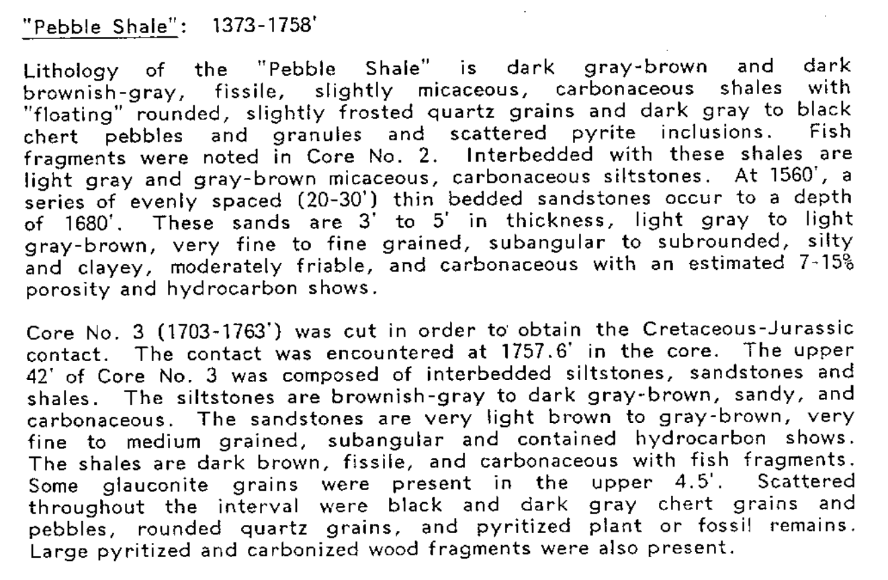

```{r setup, include=FALSE}
knitr::opts_chunk$set(echo = TRUE)
```

Selamat datang di tulisan pertama saya mengenai Data Science dan Geologi! Saya memulai tulisan ini karena terinspirasi dari rekan GeoJek saya, mas Yogi Pamadya, yang cukup aktif berbagi mengenai penerapan ilmu data di dunia geosains (cek profil dia ya untuk tulisan-tulisan menarik!). 

Bedanya (selain lebih aktif dan tulisannya lebih bagus), Yogi menggunakan Python dalam postingannya, sedangkan saya menggunakan R, khususnya `tidyverse`, sebuah package R dengan filosofi desain, grammar, dan struktur data yang menyesuaikan dengan paradigma data science yang terkini. Apabila anda lebih familiar dengan base R, siap-siap bertemu dengan operator pipe (`%>%`) yang jamak digunakan apabila kode R kita ditulis dengan `tidyverse`.

Nah, mumpung sedang libur natal, dan sudah lama ingin coba utak atik data geosains, akhirnya saya coba-coba mengulas topik yang sering ditanyakan oleh kolega saya para geologist-geologist handal yang masih berkarya di dunia migas: apa yang akan terjadi kalau kita melakukan K-means clustering pada data log sumur?

Berikut adalah package yang akan kita pakai, dan dimuat sebelum saya memulai analisis.

```{r, message=FALSE}
# load required library
library(tidyverse)
library(petroreadr)
library(factoextra)
library(reshape2)
library(viridis)
```

## Memuat Data

### Data Log Sumur
 
Sejujurnya saya ingin menggunakan data log sumur migas Indonesia di artikel ini, namun apa daya dunia migas Indonesia belum open data (welp, it rhymes!). Bayangkan berapa banyak penelitian yang bisa dilakukan apabila data E&P di Indonesia dibuka ke publik dan dapat diakses oleh masyarakat umum (knock, knock SKKMigas!).

Akhirnya, sayapun mencari log sumur dari repositori open data, dan menemukan sumur South Barrow-18 di Alaska dari link berikut: https://certmapper.cr.usgs.gov/data/PubArchives/OF00-200/WELLS/SBAR18/INDEX.HTM. Sumur ini (selanjutnya saya sebut SB-18) adalah sebuah sumur wildcat berada di utara Alaska, diselesaikan di tahun 1980, dan memproduksi gas.

Data log sumur umumnya disimpan dalam format LAS. Untungnya, ada orang baik di ujung sana yang menulis package `petroreadr` (https://github.com/ravenroadresources/petroreadr/) untuk membaca dan menulis format LAS di R. Dengan fungsi `read_las` dari `petroreadr`, memuat LAS di R jadi semudah membalikkan telapak tangan!

```{r}
# Load LAS
sb_18 <- read_las('SB18.LAS') %>%
  na_if(-999) # remove data if value is -999.00000, null value of this LAS file

glimpse(sb_18)
```

### Data Well Top

SB-18 juga memiliki data top formasi, namun bentuknya hanya teks terstruktur yang berformat TXT. Untungnya, kita bisa memuat data tersebut dengan fungsi `read_table` plus sedikit penyesuaian. Data ini memang tidak digunakan untuk clustering yang akan kita lakukan, tapi mohon diingat-ingat karena nanti akan kita gunakan setelah clustering selesai.

```{r, message=FALSE, warning=FALSE}
# Load well tops
sb_18_top <- read_table('SB18TOPS.TXT', skip = 13, n_max = 4) %>%
  select(-c('WELL NAME', 'X2', 'X4', 'X5', 'X6')) %>%
  rename(formation = `ROCK UNIT`,
         depth = `DEPTH, FEET`)

sb_18_top
```

### Memplot Data Log

Data yang sudah dimuat kemudian saya coba untuk plot, namun saya belum sempat mengeksplor cara untuk mengeplot data log seperti format tradisional dengan `ggplot`. Sayangnya hal ini jadi mempersulit kita yang ingin melakukan quicklook terhadap sumur SB-18. Kita bisa menemukan hasil scan log sumur di tautan repositori data. Anggaplah kita semua sudah membaca log sumur dengan plot standar ya!

```{r, warning=FALSE, fig.width=10, fig.height=8, fig.fullwidth=TRUE}
sb_18 %>%
  select(-WELL) %>%
  gather(key = 'log', value = 'value', -c(M__DEPTH.FT)) %>%
  ggplot(aes(y = M__DEPTH.FT, x = value, color = log)) +
  geom_path() +
  # plot well top data
  geom_hline(data = sb_18_top,
             aes(yintercept = depth),
             linetype = 'dashed',
             color = 'indianred') +
  scale_y_reverse() +
  facet_wrap(~log, nrow = 1, scales = 'free_x') + 
  theme_minimal() + 
  theme(legend.position = "none") +
  labs(title = 'Log Sumur SB-18',
      x = '',
      y = 'Kedalaman (ft MD)')
```

Garis putus-putus horizontal menunjukkan top formasi yang sebelumnya sudah dimuat. Dari plot log, terlihat bahwa log resistivitas di-run dengan log induksi (ILM dan ILD) pada lubang 12.25 inci, dan laterolog (LLS dan LLD) pada lubang 8.5 inci. Supaya lebih sederhana, kita akan melakukan clustering hanya di interval yang menggunakan laterolog untuk mengambil data resistivitas formasi.

## K-Means Clustering

K-means clustering adalah salah satu algoritma unsupervised machine learning yang dapat mengelompokkan data berdasarkan kemiripannya. "Unsupervised" berarti kita tidak melakukan pelabelan apapun sebelumnya, dan algoritma clustering akan mencari pola dalam data dengan sendirinya. Kita bisa menemukan petunjuk melakukan K-means clustering dengan R di tautan berikut: https://uc-r.github.io/kmeans_clustering. Petunjuk yang diberikan sangat jelas, dan tahapan clustering yang dilakukan di artikel ini mengacu pada tautan tersebut. 

Untuk alasan kesederhanaan, kita "memotong" data di interval dimana laterolog di-run, yaitu di kedalaman 1534 - 2100 ft.

```{r}
sb_18_ll <- sb_18 %>%
  # select quad combo log
  select(M__DEPTH.FT, GR, LLD, LLS, RHOB, NPHI, DT) %>%
  drop_na() 

# laterolog depth: 1534 - 2100 ft
summary(sb_18_ll)
```

### Cek Korelasi Antar Fitur

Dalam k-means clustering, disarankan untuk tidak menggunakan fitur (variabel) yang berkorelasi satu sama lain untuk dilakukan clustering. Untuk itu, kita perlu mengecek korelasi antar variabel dengan matriks korelasi, yang mengeplot koefisien korelasi Pearson antara satu fitur dan lainnya. Nilai koefisien 1 berarti korelasi sempurna, dan 0 berarti tidak ada korelasi sama sekali. Nilai positif berarti berbanding lurus, dan negatif berarti berbanding terbalik.

```{r}
cormat <- round(cor(sb_18_ll),2)

melted_cormat <- melt(cormat)

ggplot(data = melted_cormat, aes(x = Var1, y = Var2, fill = value)) + 
  geom_tile() +
  scale_fill_viridis() +
  geom_text(aes(label = value)) + 
  theme(axis.text.x = element_text(angle = 45, hjust = 1)) +
  theme_minimal() +
  labs(title = 'Matriks Korelasi Pearson Antar Log Sumur SB-18',
       x = '',
       y = '')
```


Beberapa korelasi yang relatif tinggi cukup intuitif, seperti bacaan shallow dan deep resistivity (LLS dan LLD), serta log sinar gamma dan NPHI yang sepertinya berasosiasi di zona shale (di zona shale, kehadiran mineral lempung mendorong bacaan GR, dan kandungan clay-bound water mendorong bacaan NPHI).

Menariknya, korelasi antara delta-t sonic log (DT) dengan kedalaman tidak terlalu tinggi, walaupun arahnya (berbanding terbalik) cukup intuitif (semakin dalam, karena kompaksi, sonic travel time semakin kecil/cepat). Apakah hal ini dikarenakan tekanan overburden tidak terlalu tinggi di Alaska sana? Saya 'sih kurang paham, mungkin anda punya pendapat lain atau lebih paham soal geologi Amerika, ditunggu komentarnya ya!

Tidak ada batasan tertentu untuk menentukan bahwa suatu fitur "sangat berkorelasi" dengan fitur lainnya, tapi umumnya nilai antara 0.75-0.85 digunakan sebagai batas. Saya menggunakan 0.8 sebagai ambang batas, sehingga salah satu di antara LLS dan LLD harus dikeluarkan dari proses clustering.

### Menyiapkan Data untuk Clustering

Karena menggunakan mean, algoritma K-means clustering sangat sensitif terhadap perbedaan skala nilai. Sehingga, umumnya kita melakukan scaling terhadap dataset, yaitu menjadikan mean data sebagai 0, dan standar deviasi tiap data sebagai satuan. Untuk melakukan scaling di R, kita bisa menggunakan fungsi `scale`.

```{r}
sb_18_ll_scaled <- sb_18_ll %>%
  # remove LLS as it is highly correlated with LLD, and depth as it is not conveying any formation info
  select(-c(LLS, M__DEPTH.FT)) %>%
  scale()

head(sb_18_ll_scaled)
```

Dalam K-means clustering, kita harus memasukkan jumlah cluster ("k") sebagai suatu parameter. Banyak cara untuk menentukan jumlah cluster, tetapi cara yang paling umum digunakan adalah elbow method.

```{r}
# set seed for reproducible result
set.seed(666)

# elbow
# function to compute total within-cluster sum of square 
wss <- function(k) {
  kmeans(sb_18_ll_scaled, k, nstart = 25)$tot.withinss
}

# Compute and plot wss for k = 1 to k = 10
k.values <- 1:10

# extract wss for 2-10 clusters
wss_values <- map_dbl(k.values, wss)

plot(k.values, wss_values,
     type = "b", pch = 19, frame = FALSE, 
     main = 'Elbow method untuk menentukan jumlah cluster yang optimal',
     xlab = "Number of clusters K",
     ylab = "Total within-clusters sum of squares")
```

Dalam elbow method, kita ingin 'within-clusters sum of squares' (WSS, semacam jarak antara datapoint dengan centroid cluster) sekecil mungkin (artinya cluster kita cukup kompak) dengan jumlah cluster sesedikit mungkin (karena cluster tidak akan berguna kalau jumlahnya terlalu banyak). Karena itu saya memilih 4 sebagai 'elbow', di mana WSS sudah cukup kecil, dan laju pengurangannya sudah tidak signifikan setelah 4 cluster.

Setelah menentukan jumlah cluster yang optimal, kita bisa melakukan clustering di dataset utama dan menambahkan kolom cluster di dataset tersebut.

```{r}
clustered <- kmeans(sb_18_ll_scaled, centers = 4, nstart = 25)

sb_18_ll_clustered <- sb_18_ll %>%
  mutate(cluster = clustered$cluster)

head(sb_18_ll_clustered)
```

## Hasil Clustering

### Visualisasi cluster

Umumnya hasil clustering divisualisasikan dengan plot Principal Component seperti di bawah ini, di mana fitur-fitur (dalam hal ini log) yang dimasukkan ke dalam clustering dikelompokkan menjadi "principal component" supaya bisa diplot dalam dua dimensi. Dari visualisasi di bawah ini, dapat dilihat bahwa k-means clustering cukup berhasil memisahkan karakteristik log, dengan Cluster 1 yang relatif berbeda dari cluster-cluster lainnya.

```{r}
fviz_cluster(clustered, data = sb_18_ll) +
  theme_minimal()
```

### Hasil clustering vs. data log

Untuk memplot data categorical (label cluster) terhadap data continuous (data log), saya menggunakan boxplot, yang menggambarkan persebaran kuartil 1 dan 3 (ujung kotak), dan median (garis di dalam kotak) dari tiap kurva log. 

```{r}
sb_18_ll_clustered %>%
  select(-M__DEPTH.FT) %>%
  gather(key = 'log', value = 'value', -cluster) %>%
  ggplot(aes(x = factor(cluster), y = value)) +
  geom_boxplot() +
  facet_wrap(~ log, ncol = 3, scales = 'free_y') +
  theme_minimal() +
  labs(title = 'Plot Cluster Terhadap Data Log Sumur SB-18',
       x = 'Cluster',
       y = 'Nilai')
```

Beberapa pengamatan yang cukup menarik:

* Cluster 1 memiliki persebaran GR yang rendah, LLD tinggi, NPHI rendah, dan RHOB rendah relatif terhadap cluster-cluster lainnya. Berdasarkan data tersebut, ditambah pengetahuan bahwa sumur SB-18 adalah sumur discovery, sepertinya Cluster 1 mengumpulkan zona hidrokarbon. Hal ini dapat dipahami karena zona hidrokarbon memiliki karakteristik log yang cukup berbeda dengan zona air, dan pastinya algoritma K-means akan mengumpulkan zona-zona tersebut dalam satu cluster 

* Cluster 2, 3, dan 4 sepertinya terbagi karena fasies log, bukan karena kandungan fluida seperti Cluster 1. Selain itu, dari seluruh log quad combo, dapat dilihat bahwa Cluster 2 adalah zona yang lebih shaly dibanding Cluster 3, yang juga lebih shaly dibanding Cluster 4.

Dari pengamatan tersebut, bisa disimpulkan bahwa K-means clustering yang baru saja kita lakukan dengan 4 cluster sepertinya menghasilkan pembagian antara zona hidrokarbon vs zona non-hidrokarbon (Cluster 1 vs. yang lainnya), serta 3 fasies log (Cluster 2, 3, dan 4) dengan karakter log yang berbeda-beda.

### Hasil clustering vs. data top formasi

Lalu pertanyaan selanjutnya: apa benar clustering kita menghasilkan pembagian fasies log, yang (harusnya) memiliki korelasi terhadap satuan batuan/litologi? 

Masih ingat data top formasi yang kita muat di awal artikel? Nah, sekarang saatnya kita cek hasil K-means clustering kita dengan data top formasi yang dihasilkan oleh geologist-geologist handal tersebut. Setahu saya, di dunia operasi migas, top formasi ini adalah hasil interpretasi multidisiplin yang melibatkan data cutting atau core pemboran, data log sumur, maupun data survey seismik yang dilakukan baik oleh wellsite geologist di lapangan, maupun geologist dan geophysicist setelah operasi pemboran selesai. Singkat cerita, seharusnya data well top bisa menjadi ground truth dalam mengkalibrasi hasil eksplorasi data kita kepada kenyataan geologi yang ada.

Untuk melihat, sekali lagi saya menggunakan boxplot, tapi kali ini antara cluster dan kedalaman sumur. Selain itu, saya juga menandai top Kingak Shale di kedalaman 1760 ft, berbatasan dengan Pebble Shale Unit di atasnya. Saya menggunakan dataframe hasil pembacaan file TXT di awal, yaitu `sb_18_top`.

```{r}
sb_18_ll_clustered %>%
  # remove cluster 1 as it is clear that it is associated with HC-bearing zone, not lithologies
  filter(cluster != 1) %>%
  ggplot(aes(y = M__DEPTH.FT, x = factor(cluster))) +
  geom_jitter(alpha = 0.2) +
  geom_boxplot() +
  geom_hline(data = subset(sb_18_top, depth >= 1534), # welltops in laterolog interval (>= 1534 ft)
             aes(yintercept = depth),
             linetype = 'dashed',
             color = 'indianred') + 
  annotate("text", x = 3.3, y = 1740, label = c("Pebble Shale")) + 
  annotate("text", x = 3.3, y = 1780, label = c("Kingak Shale")) +
  scale_y_reverse() +
  theme_minimal() +
  labs(title = 'Plot Cluster Terhadap Kedalaman Sumur SB-18',
       x = 'Cluster',
       y = 'Kedalaman (ft MD)')
```

Hasil clustering 2, 3, dan 4 sepertinya memang merepresentasikan persebaran litologi dalam sumur SB-18. Dapat dilihat bahwa sebaran Cluster 2 berkorelasi dengan zona Pebble Shale Unit. Sedangkan, Cluster 3 dan 4 membagi Kingak Shale menjadi dua fasies log yang berbeda, di mana Cluster 3 adalah zona yang lebih shaly daripada Cluster 4. Kita juga bisa melihat zona transisi antara Pebble Shale dan Kingak Shale, di mana Cluster 2 dan Cluster 3 masih dapat ditemui di sekitar batas formasi.

Deskripsi Pebble Shale Unit dapat ditemukan di laporan geologi sumur SB-18 (https://certmapper.cr.usgs.gov/data/PubArchives/OF00-200/WELLS/SBAR18/PDF/SB18GEOL.PDF) yang sayangnya berupa scan dokumen. Deskripsi tersebut sepertinya cocok dengan temuan kita dari k-means clustering, di mana litologi Pebble Shale Unit (1373 - 1758 ft) adalah perselingan antara batuserpih karbonan (carbonaceous shale) warna abu-abu kecokelatan, dan batulanau karbonan warna abu-abu terang.



Di laporan yang sama, kita juga bisa menemukan Kingak Shale (1758 - 2135 ft) yang dideskripsikan sebagai perselingan batulempung, batulanau, dan batupasir, dengan fasies pasiran yang lebih banyak ditemukan setelah kedalaman 1916 ft.


Menariknya, di zona Kingak Shale, terdapat satuan batupasir Barrow di kedalaman 1976 - 2072 ft. Sepertinya, k-means clustering yang kita lakukan berhasil membedakan antara Kingak Shale dengan Barrow Sandstone yang lebih 'clean'.


Dengan demikian, bisa disimpulkan bahwa:

* Cluster 2 berkorelasi dengan Pebble Shale Unit
* Cluster 3 berkorelasi dengan Kingak Shale
* Cluster 4 berkorelasi dengan Upper dan Lower Barrow Sandstone

## Kesimpulan dan Saran

Ini merupakan pertama kalinya saya kembali membuka data log sumur setelah sekian lama, dan rupanya menarik juga melakukan analisis data dengan cara pandang baru dan dengan tool yang berbeda sama sekali! Kita bisa melihat bagaimana sebuah algoritma unsupervised bekerja: berikan data tanpa label apa-apa, dan algoritma akan mencari pola dengan sendirinya.

Berdasarkan analisis yang baru saja kita lakukan, ada beberapa poin menarik yang ingin saya sampaikan:

* K-means clustering bisa digunakan untuk membagi fasies log sumur
* Pisahkan antara zona HC dan non-HC ketika melakukan clustering apabila tujuan utamanya adalah mendapatkan pembagian fasies litologi
* Untuk menentukan litofasies dalam suatu formasi, sebaiknya clustering dilakukan hanya di formasi tersebut saja
* Apabila mungkin, selalu lakukan kalibrasi terhadap ground truth, misal data core atau interpretasi geologi/geofisika lainnya
* Jangan lupakan metode yang lebih tradisional dalam memplot dan membaca log sumur, karena teknik dan algoritma data science pada akhirnya hanyalah alat bantu dalam melakukan interpretasi

Terima kasih telah membaca. Ada komentar? Menemukan kesalahan interpretasi? Butuh masukan? Yuk berdiskusi :)
